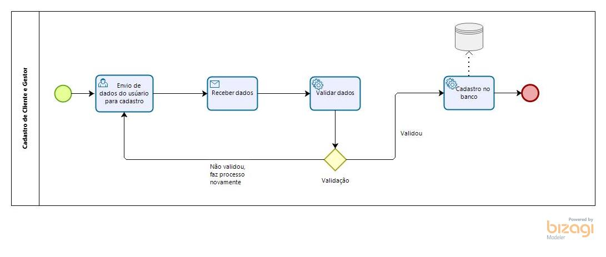
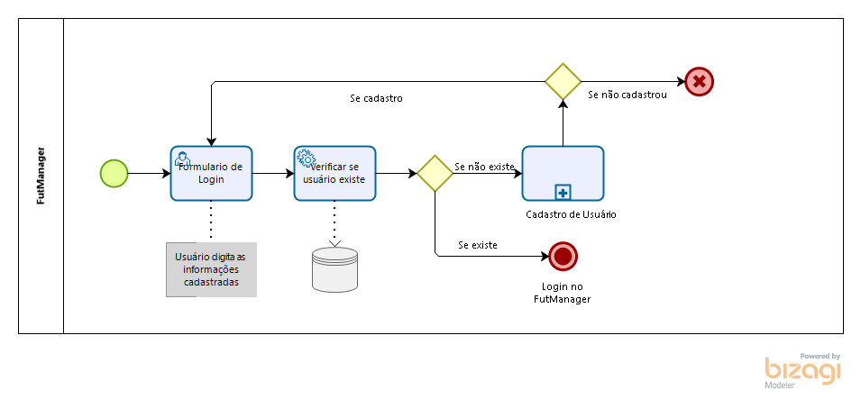
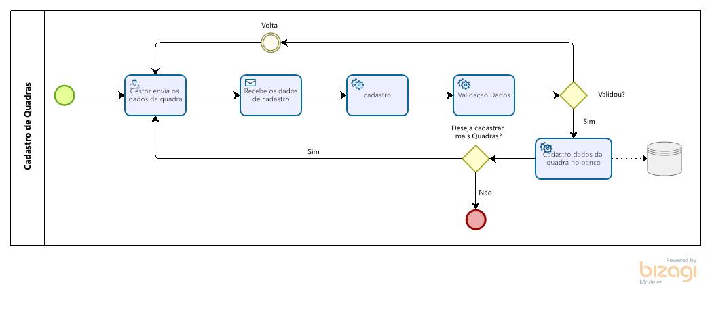
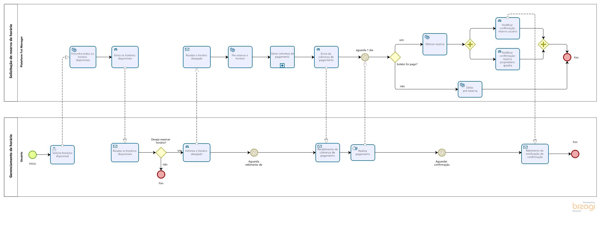
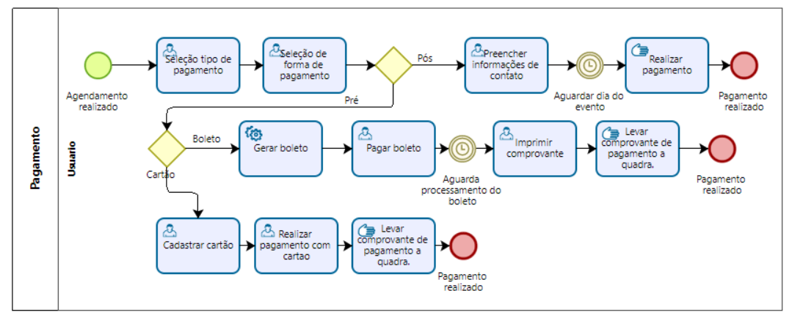
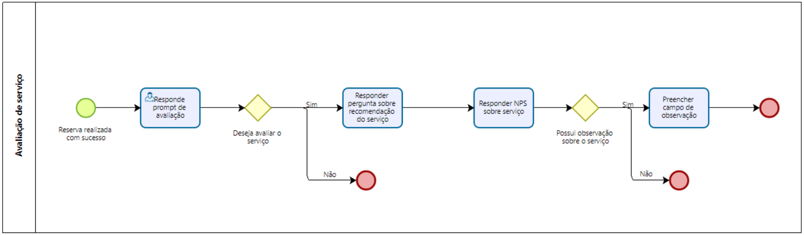
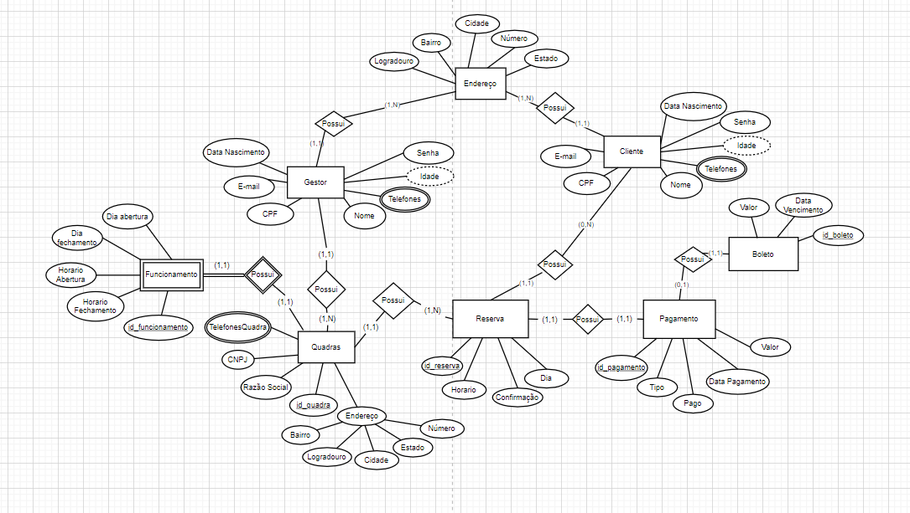

# Fut Manager

**Mateus Gomes Pereira Silva, mateus.silva.1004445@sga.pucminas.br**

**Octavio Augusto Pereira Martins, oapmartins@sga.pucminas.br**

**Pedro Henrique Damasceno Dias, pedro.hdias@outlook.com**

**Samuel Ribeiro de Freitas, srfreitas97@gmail.com**

**Thiago Costa de Souza Pereira, tcspereira@sga.pucminas.br**

---

_Curso de Engenharia de Software, Unidade Praça da Liberdade / Curso de Sistemas de Informação, Unidade São Gabriel_

_Instituto de Informática e Ciências Exatas – Pontifícia Universidade de Minas Gerais (PUC MINAS), Belo Horizonte – MG – Brasil_

---

_**Resumo**. Escrever aqui o resumo. O resumo deve contextualizar rapidamente o trabalho, descrever seu objetivo e, ao final, 
mostrar algum resultado relevante do trabalho (até 10 linhas)._

---

## 1. Introdução

O projeto do sistema Gestão de Quadras será um software que irá reunir "peladeiros" e donos de quadras em uma gestão automatizada dos processos, para a facilidade do gerenciamento de quadras e centros esportivos. Pode-se citar entre esses processos: cadastro e atendimento ao cliente; cadastro de quadra; agenda de horários disponíveis e reservas destes; cobrança e pagamentos.

A finalidade do sistema será auxiliar na administração, para a organização de produtos, serviços e clientes. A fim de automatizar processos para uma forma mais prática, ágil e simples.

    1.1 Contextualização

O projeto tem como finalidade o gerenciamento de quadras, se qualificando no ramo de negócios que se trata a esportes e lazer de clientes como um todo. Atualmente o Brasil consta com mais de 30 mil atletas registrados , 12 milhões de adeptos ao futebol Society e com mais de 4 mil campos disponíveis em todo território nacional segundo a Confederação Brasileira de Futebol 7 Society. Visto tal fato, coloca-se como necessário a entrada de tecnologias que visam auxiliar esse grande mercado de esportes, para assim, gerar automatização de processos gerais, desde ao contato ao clientes até o termino do seu "jogo". Com isso, o software FutManager veio para facilitar pequenas empresas de quadras que visam a entrada no mercado e até mesmo melhora das já existentes.

    1.2 Problema

O Fut Manager é um software que visa realizar a ponte entre jogadores de futebol, amadores ou profissionais, e donos de quadras. Hoje, o fluxo normal de quem deseja encontrar uma quadra disponível em sua região passa por realizar uma pesquisa por centros esportivos em sua região na internet, entrar em contato, realizar o levantamento de preço, conferir os dias e horários diponíveis, para, caso positivo, realizar a alocação da quadra. Da perspectiva do centro esportivo, a divulgação de suas quadras e promoções, gerenciar o quadro de horários, as abstenções de ultima hora, passam a se tornar um ofensor.

    1.3 Objetivo geral

Facilitar a gestão de quadras transformando um modelo de negócio informal em um modelo escalável e sustentável.

        1.3.1 Objetivos específicos

- Facilitar o agendamento de horários nas quadras, tanto por parte do cliente quanto do fornecedor.

- Melhorar a visualização de horários disponíveis.

- Melhorar o sistema de cobrança e pagamentos.

- Implementar um tratamento de fluxo de exceção no modelo de negócio. (Quando um cliente desiste de um horário).
  
    1.4 Justificativas

- A maioria das empresas de locação de quadras não tem um processo bem definido, o que abre margem para vários furos no modelo de negócio.

- A digitalização do processo de aluguel de quadras aumentará a produtividade e facilitará o processo para os clientes.

- A digitalização ajudará na divulgação de muitas quadras que não tem um marketing envolvido no negócio.

## 2. Participantes do processo

    2.1 PERSONA 1
    
 Fábio tem 41 anos, é casado e atualmente trabalha como dono/gestor de quadras de futebol na região onde vive. Sua personalidade é de uma pessoa brincalhona e bem humorada, é também um ótimo empreendedor. Seu sonho atualmente é conhecer o mundo e poder melhorar e ampliar seus negócios. Porém, um problema que Fábio enfrenta atualmente é a falta de organização em sua quadra. Fábio se utiliza de uma agenda para se organizar mas, mesmo assim, não foram raras as vezes que ele acabou reservando um mesmo horário para mais de uma pessoa. O sistema de gestão de quadras sanará este e outros problemas. Com o sistema, Fábio poderá ter controle total em sua agenda, sabendo quais horários estão disponíveis, pré-reservados ou reservados. Ele também não precisará mais se preocupar com confirmação de presença ou com a divulgação de sua quadra.

    2.2 PERSONA 2

Paulo tem 25 anos é solteiro e estudante, ele adora se reunir com os amigos nos finais de semana para jogar futebol. Entre os amigos, Paulo é o responsável por organizar as partidas e o churrasco ao final de cada partida, mas ele sempre encontra dificuldade em encontrar uma quadra que tenha disponível o horário em que ele, e seus amigos, possam se reunir para jogar. Além disso, durante a manhã em que o jogo ocorrerá, Paulo perde boa parte de seu tempo confirmando se todos os seus amigos poderão comparecer. Com o sistema de gestão de quadras Paulo não terá mas estes problemas. Ao utilizá-lo, ele poderá facilmente encontrar quais quadras possuem o horário que ele e seus amigos desejam, podendo facilmente realizar uma pré-reserva ou até mesmo cancelá-la. O sistema também automatizará o processo de confirmação de presença, assim Paulo poderá ter mas tempo para preparar o churrasco.

## 3. Modelagem do processo de negócio

## 3.1. Análise da situação atual

No momento atual que vivemos o futebol 7 ou chamado Society está em crescimento atual por ser tratar de uma lazer entre crianças, jovens e até adultos como também da grande existencia de quadras ao decorrer de todo território. Através desse grande fluxo de atletas e quadras citadas, encontra-se o problema tanto de jogadores para marcação de seus horários quanto dos gestores de quadras que muitas das vezes trabalham sozinhos para a administração deste grande volume. O processo normalmente ocorre de forma manual. 

* O cliente precisa entrar em contato presencialmente (maioria das vezes) ou por telefone para realizar a marcação de horários;
* Logo após o contato o dono da quadra precisa conferir em seu caderno de anotações a existencia de um novo horário (que sendo manuel pode ocorrer de esquecer da marcação ou a duplicidade de horários)
* A cobrança feita de "boca a boca", com confunsões em pagamentos e cobrança indevida, sem uma gerencia de pagamentos por parte de cada "jogador"
* Pagamento somente em dinheiro e cartão, com ausencia de pagamento online e agendamento de pagamento caso cliente esqueça o cartão ou não tenha pagamento naquele determinado dia. 

Pode-se citar para resolução desses problemas a criação do Fut Manager que venha unificar todos os processos do negócio. Entre eles podemos citar cadastro e atendimento ao cliente; cadastro de quadra; agenda de horários disponíveis e reservas destes; cobrança e pagamentos.

* Através do cadastro de clientes o gestor de quadras pode ter seus dados para poder realizar um melhor atendimento ao clientes, pode-se saber as melhores possibilidades de horários para atendimento deste, ligações de feedbacks, programas de fidelidade e entre outras. 

* O gestor da quadra irá ter a possibilidade do cadastramento de várias quadras em seu próprio site para administração destas, possibilita-se assim ao cliente ver as quadras mais próximas da sua região e perceber a estrutura desta visa-se o atendimento as suas demandas esportivas. 

* Agenda de horários irá facilitar para a locação de clientes em diferentes horários, que facilita ao precisar de entrar em contato presencialmente com o dono da quadra. Junto a este, é disponibilizado um quadro de horários, que o usuário tem possibilidade de agendar o horário e dia dia disponível para sua demanda e em caso de duplicidade de horários o não aceitamento do sistema (uma administração de horário para o gestor da quadra). 

* Já a questão de pagamentos e cobrancas será responsável pelo gerenciamento das vendas, como se fosse uma loja virtual, um ambiente que troca a dificuldade de pagamento presencial por uma forma online que oferece praticidade e segurança aos clientes.

## 3.2. Descrição Geral da proposta

A proposta da FutManager é criar uma plataforma capaz de facilitar o processo de uma reserva de quadra de futebol. Para isso, a plataforma contemplará poucas funcionalidades, mas que todas elas sejam essenciais para torna a experiçência de usuário mais simples, conveniente e intuitiva. 

Sendo assim, da pespectiva de quem deseja alugar uma quadra, a plataforma permitirá que o processo de reserva seja totalmente online. Nele, o usuário será capaz de encontrar quais quadras e horários estão disponiveis em um determinado dia e região, realizar o pagamento e confirmar a presença de quais de seus amigos irão comparecer.

A plataforma também permitírá que o gestor de uma quadra possa ter a sua agenda de reserva de horário e controle financeiro automatizados, além de dar visibilidade de sua quadra a toda a base de usuários da FutManager.

Ao colocar em pespectiva um futuro breve, dentre as oportunidades de melhorias, a plataforma poderá: 

* Integraçoes com os pricipais sistemas ERPs que, por ventura, o gestor de quadras já utilize. 
* adicionae sistema de valiação da estrutura da quadra para auxiliar o usuário a escolher a melhor opção. 
* Pagamento por visibilidade, onde o gestor de uma quadra poderá pagar para ganhar mais destaque dentro do sistema de busca. 
* Sistema de cupons e fidelização.
  
  ## 3.3. Processos

### 3.3.1 Processo 1 – Cadastro Cliente e Gestor

Processo de cadastro de cliente levará em conta o cliente ao entrar no site, tendo interesse por este, para realizar o cadastro o cliente/gestor enviará seus dados para o sistema, ao recebe-los o sistema passará por uma etapa de validação feito pelo próprio, caso seja aprovada o sistema cadastrará o usuário/gestor e irá adiciona-lo no banco, caso contrário ele é direcionado ao envio novamente dos dados.

### 3.3.2 Processo 3 – Login

Após o processo de cadastro de usuário, temos o login do usuário no sistema. O processo irá validar se o usuário foi criado corretamente a partir deste cadastrado no banco e realizará o final do processo, assim, entra-se no sistema.

### 3.3.3 Processo 3 – Cadastro de Quadras

No processo de cadastro de Quadras, o cliente inicialmente envia os dados da quadra, para ser realizado o cadastro. Depois de passar pela validação, os dados são enviados ao banco. Após completar o cadastro, é exibida uma janela de escolhas, onde é perguntado, se ele deseja continuar e cadastrar mais quadras, ou finalizar.

### 3.3.4 Processo 4 – Reserva de Horários

O processo permitirá ao usuário encontrar quais horários então disponíveis em uma quadra. Nele, o usuário, caso tenha interesse por algum dos horários disponíveis, deverá realizar a pré-reserva. A pré-reserva consiste em uma taxa que deverá ser paga em até um dia e, somente após a confirmação do pagamento, será efetivada a reserva de horário. Uma vez paga a taxa, o valor não poderá ser reavido pelo usuário.

### 3.3.5 Processo 5 – Pagamento

O Processo permitirá ao usuário escolher o tipo de pagamento, entre pré e pós. Para ambos os tipos de pagamento haverão duas formas, sendo elas através de cartão ou boleto. Após a confirmação do pagamento no método pré, será necessário levar o comprovante no dia da realização do evento. No pagamento pós, o usuário pagará no local após a realização do evento.

### 3.3.6 Processo 6 – Avaliação do serviço

Após a realização de uma reserva, o usuário será questionado se deseja avaliar o serviço utilizado. Através do feedback dos usuários será possível otimizar e refinar o processo de negócio. Os feedbacks serão armazenados em banco e utilizados em dashboards.

## 4. Projeto da Solução

### 4.1. Detalhamento das atividades

Descrever aqui cada uma das propriedades das atividades de cada um dos processos. Devem estar relacionadas com o modelo de processo apresentado anteriormente.

#### Processo 1 – Cadastro de Cliente e Gestor

**Informação sobre o Cadastro de Cliente/Gestor**

 Será a página inicial do processo, que após o usúario do sistema se interessar por este, tem a oção de realizar seu cadastro para otimizar seu lazer. Dentro do cadastro o usuário tera a opção de selecionar se será um cliente (jogador) ou um gestor (dono/administrador de quadra), é requerido também as informações básicas do usuário, como nome e dados de contato, validação usuário real ou repitido a partir do CPF, criação de senha e opções de colocar foto de perfil e escrever um pequeno texto sobre o motívo do cadastro e a inspiração deste.

| **Campo**                    | **Tipo**       | **Restrições**                                                                 | **Valor default** |
| ---------------------------- | -------------- | ------------------------------------------------------------------------------ | ----------------- |
| Nome                         | Caixa de texto | Preenchimento obrigatório; Bloqueio caracteres especiais                       |                   |
| Sobreenome                   | Caixa de texto | Preenchimento obrigatório; Bloqueio caracteres especiais                       |                   |
| CPF                          | Número         | Preenchimento Obrigatório, mínimo de 11 caractesres                            |                   |
| Data nascimento              | Caixa de Texto | Preenchimento obrigatório, formato data                                        |                   |
| Sexo                         | Seleção Única  | Uma opção deve ser preenchida                                                  |                   |
| Celular para Contato         | Número         | Preenchimento obrigatório, formatação de Telefone                              |                   |
| CEP                          | Número         | Preenchimento Obrigatório                                                      |                   |
| Logradouro                   | Caixa de Texto | Preenchimento à partir da entrada do CEP                                       |                   |
| Número                       | Caixa de Texto | Preenchimento obrigatório                                                      |                   |
| Complemento                  | Caixa de Texto | Preenchimento opcional                                                         |                   |
| Bairro                       | Caixa de Texto | Preenchimento à partir da entrada do CEP                                       |                   |
| Cidade                       | Caixa de Texto | Preenchimento à partir da entrada do CEP                                       |                   |
| Estado                       | Seleção Única  | Preenchimento à partir da entrada do CEP                                       |                   |
| Ponto de referência          | Caixa de Texto | Preenchimento opcional                                                         |                   |
| E-mail                       | Caixa de texto | Formato e-mail                                                                 |                   |
| Senha                        | Caixa de Texto | Mínimo 8 caracteres; Senha forte: Conter caracteres especiais e conter números |                   |
| Confirmar senha              | Caixa de Texto | Valor do campo ser igual ao da senha                                           |                   |
| Escolha de Cliente ou Gestor | Seleção Única  | Uma opção deve ser preenchida                                                  |                   |

#### Processo 2 – Cadastro de Quadras

**Informação sobre o Cadastro das Quadras**

 Após o cadastro do Gestor, ou dentro do sistema na parte específica de cadastro de quadras, é possivel realizar o cadastro das quadras. Nesse cadastro, é requerido as informações básicas, como localidade da quadra, horário de funcionamento, informações para contato e até mesmo fotos (opcinal).  

| **Campo**                 | **Tipo**       | **Restrições**                                  | **Valor default** |
| ------------------------- | -------------- | ----------------------------------------------- | ----------------- |
| Rasão Social              | Caixa de Texto | Preenchimento Obrigatório                       |                   |
| Nome Fantasia             | Caixa de Texto | Preenchimento Obrigatório                       |                   |
| CNPJ                      | Número         | Preenchimento Obrigatório, mínimo 14 carácteres |                   |
| Telefone                  | Número         | Preenchimento Opcional, formatação de Telefone  |                   |
| Observações               | Caixa de Texto | Preenchimento Opcional                          |                   |
| CEP                       | Número         | Preenchimento Obrigatório                       |                   |
| Logradouro                | Caixa de Texto | Preenchimento feito à partir da entrada do CEP  |                   |
| Número                    | Número         | Preenchimento feito à partir da entrada do CEP  |                   |
| Complemento               | Caixa de Texto | Preenchimento Opcional                          |                   |
| Bairro                    | Caixa de Texto | Preenchimento feito à partir da entrada do CEP  |                   |
| Cidade                    | Caixa de Texto | Preenchimento feito à partir da entrada do CEP  |                   |
| Estado                    | Seleção Única  | Preenchimento feito à partir da entrada do CEP  |                   |
| Horário Comercial Inicial | Caixa de Texto | Obrigatório, padrão do horário 00:00            |                   |
| Horário Comercial Final   | Caixa de Texto | Obrigatório, padrão do horário 00:00            |                   |
| Ponto de referencia       | Caixa de texto | Preenchimento Opcional                          |                   |
| Adcionar imagens          | Imagens        | Preenchimento Opcional                          |                   |

#### Processo 3 – Reserva de Horários

**Solicita horários disponíveis**

 A plataforma retornará ao usuário um formulário. O mesmo deverá informar qual o período de datas e cidade deseja consultar por horários. Opcionalmente, o usuário também poderá especificar por quais quadras deseja consultar. 

| **Campo**    | **Tipo**         | **Restrições**                             | **Valor default**   |
| ------------ | ---------------- | ------------------------------------------ | ------------------- |
| Data inicial | Data             | Obrigatório e maior ou igual a data atual  | Data atual          |
| Data final   | Data             | Obrigatório, maior ou igual a data inicial | Data atual          |
| Estado       | Seleção única    | Obrigatório                                | Dropdown vazio      |
| Cidade       | Seleção única    | Obrigatório                                | Dropdown vazio      |
| Quadra       | Múltipla escolha | Não obrigatório                            | Checkbox desmarcado |

**Informa o horário desejado**

 Para o filtro informado pelo usuário, a plataforma deverá retornar, caso haja, a relação de todos os horários disponíveis. A relação será uma tabela composta pelo nome e endereço da quadra, data e horário. Nesta tabela o usuário deverá marca por qual horário deseja realizar a pré-reserva.

| **Campo** | **Tipo**         | **Restrições**                    | **Valor default**   |
| --------- | ---------------- | --------------------------------- | ------------------- |
| Horário   | Múltipla escolha | Obrigatório seleção de um ou mais | Checkbox desmarcado |
|           |                  |                                   |                     |

#### Processo 4 – Fluxo de Pagamento
**Preencher informações de contato**

Será fornecido um formulário para o usuário preencher os dados do cartão que será utilizado caso opte pelo tipo de pagamento pós. Os dados informados pelo usuário serão utilizados para pagamentos futuros. O formulário conterá os campos necessários para serem enviados ao gateway de pagamento.

| **Campo**         | **Tipo**       | **Restrições**              | **Valor default** |
| ----------------- | -------------- | --------------------------- | ----------------- |
| Numero do Cartão  | Caixa de texto | Somente números             | Vazio             |
| Validade          | Caixa de texto | Somente números             | Vazio             |
| CVV               | Caixa de texto | Somente números             | Vazio             |
| Nome do Titlar    | Caixa de texto | Caracteres de texto somente | Vazio             |
| Apelido do cartão | Caixa de texto | Opcional                    | Vazio             |
| CPF/CNPJ titular  | Caixa de texto | Somente números             | Vazio             |

#### Processo 5 – Fluxo de Avaliação
**Perguntas de avaliação**

Após a efetuação da reserva o usuário receberá um alerta com a opção de avaliar o serviço obtido. O fluxo consiste em perguntas sobre recomendação, um NPS sobre o serviço e uma caixa de texto de observação.

| **Campo**               | **Tipo**       | **Restrições**              | **Valor default** |
| ----------------------- | -------------- | --------------------------- | ----------------- |
| Seleção de recomendação | Select         | Sim ou Não                  | Sim               |
| NPS do serviço          | Select         | Range de zero a dez         | 10                |
| Campo de Observação     | Caixa de texto | Máximo de 200 caracteres    | Sim               |

### 4.2. Tecnologias

Nosso software se caracteriza sendo um sistema-web, em que as linguagens ultilizadas para para criação do front (parte visível pelos usuários) será HTML para linguagem de marcação, CSS editor de visualização no front e também consta a utilização do Bootstrap para auxiliar na responsividade do site. Para o back-end, assunto em discussão está em aberto, em que a linguagem que mais chama a atenção de todos integrantes do grupo é JavaScript. Dentre isso, para finalizar foi discutido a utilização MySQL 

## 5. Modelagem de dados

Apresente o modelo de dados. Defina o dicionário de dados com os respectivos formatos e significados.

### 5.1. Diagrama de Entidade-Relacionamento

Diagrama de Entidade-Relacionamento (DER) criado a partir do detalhamento de atividades

## 6. Indicadores de desempenho

Apresente aqui os principais indicadores de desempenho e algumas metas para o processo. Atenção: as informações necessárias para gerar os indicadores devem estar contempladas no diagrama de classe. Colocar no mínimo 5 indicadores.

Usar o seguinte modelo:

| **Indicador**               | **Objetivos**                                                         | **Descrição**                                             | **Cálculo** | **Fonte dados**     | **Perspectiva**           |
| --------------------------- | --------------------------------------------------------------------- | --------------------------------------------------------- | ----------- | ------------------- | ------------------------- |
| Percentual reclamações      | Avaliar quantitativamente as reclamações                              | Percentual de reclamações em relação ao total atendimento |             | Tabela reclamações  | Aprendizado e Crescimento |
| Taxa de Requisições abertas | Melhorar a prestação de serviços medindo a porcentagem de requisições | Mede % de requisições atendidas na semana                 | \*100       | Tabela solicitações | Processos internos        |
| Taxa de entrega de material | Manter controle sobre os materiais que estão sendo entregues          | Mede % de material entregue dentro do mês                 |             | Tabela Pedidos      | Clientes                  |

Obs.: todas as informações para gerar os indicadores devem estar no diagrama de classe **a ser proposto**

## 7.Sistema desenvolvido

Faça aqui uma breve descrição do software e coloque as principais telas com uma explicação de como usar cada uma.

## 8. Avaliação

Faça aqui sobre a avaliação do software. Indique se ele atendeu as expectativas e ele é viável. Para não ficar subjetivo, o ideal é fazer um questionário e pedir ao usuário do processo que faça a avaliação

## 9. Conclusão

Apresente aqui a conclusão do seu trabalho. Discussão dos resultados obtidos no trabalho, onde se verifica as observações pessoais de cada aluno. Poderá também apresentar sugestões de novas linhas de estudo.

# REFERÊNCIAS

Como um projeto de software não requer revisão bibliográfica, a inclusão das referências não é obrigatória. No entanto, caso você deseje incluir referências relacionadas às tecnologias, padrões, ou metodologias que serão usadas no seu trabalho, relacione-as de acordo com a ABNT.

Verifique no link abaixo como devem ser as referências no padrão ABNT:

http://www.pucminas.br/imagedb/documento/DOC\_DSC\_NOME\_ARQUI20160217102425.pdf

**[1.1]** - _ELMASRI, Ramez; NAVATHE, Sham. **Sistemas de banco de dados**. 7. ed. São Paulo: Pearson, c2019. E-book. ISBN 9788543025001._

**[1.2]** - _COPPIN, Ben. **Inteligência artificial**. Rio de Janeiro, RJ: LTC, c2010. E-book. ISBN 978-85-216-2936-8._

**[1.3]** - _CORMEN, Thomas H. et al. **Algoritmos: teoria e prática**. Rio de Janeiro, RJ: Elsevier, Campus, c2012. xvi, 926 p. ISBN 9788535236996._

**[1.4]** - _SUTHERLAND, Jeffrey Victor. **Scrum: a arte de fazer o dobro do trabalho na metade do tempo**. 2. ed. rev. São Paulo, SP: Leya, 2016. 236, [4] p. ISBN 9788544104514._

**[1.5]** - _RUSSELL, Stuart J.; NORVIG, Peter. **Inteligência artificial**. Rio de Janeiro: Elsevier, c2013. xxi, 988 p. ISBN 9788535237016._

# APÊNDICES

**Colocar link:**

Do código;

Dos artefatos;

Da apresentação final;

Do vídeo de apresentação.
