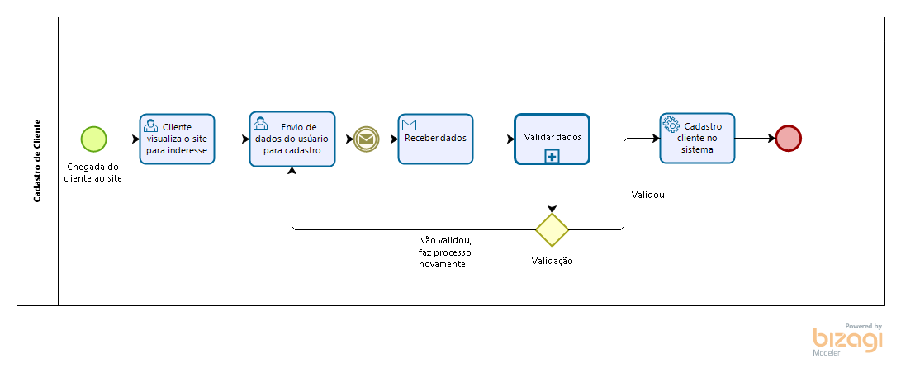

# Fut Manager

**Mateus Gomes Pereira Silva, mateus.silva.1004445@sga.pucminas.br**

**Octavio Augusto Pereira Martins, oapmartins@sga.pucminas.br**

**Pedro Henrique Damasceno Dias, pedro.hdias@outlook.com**

**Samuel Ribeiro de Freitas, srfreitas97@gmail.com**

**Thiago Costa de Souza Pereira, tcspereira@sga.pucminas.br**

---

_Curso de Engenharia de Software, Unidade Praça da Liberdade / Curso de Sistemas de Informação, Unidade São Gabriel_

_Instituto de Informática e Ciências Exatas – Pontifícia Universidade de Minas Gerais (PUC MINAS), Belo Horizonte – MG – Brasil_

---

_**Resumo**. Escrever aqui o resumo. O resumo deve contextualizar rapidamente o trabalho, descrever seu objetivo e, ao final, 
mostrar algum resultado relevante do trabalho (até 10 linhas)._

---

## 1. Introdução

O projeto do sistema Gestão de Quadras será um software que irá reunir "peladeiros" e donos de quadras em uma gestão automatizada dos processos, para a facilidade do gerenciamento de quadras e centros esportivos. Pode-se citar entre esses processos: cadastro e atendimento ao cliente; cadastro de quadra; agenda de horários disponíveis e reservas destes; cobrança e pagamentos.

A finalidade do sistema será auxiliar na administração, para a organização de produtos, serviços e clientes. A fim de automatizar processos para uma forma mais prática, ágil e simples.

    1.1 Contextualização

O projeto tem como finaliade o gerenciamento de quadras, se qualificando no ramo de negócios que se trata a esportes e lazer de clientes como um todo. Atualmente o Brasil consta com mais de 30 mil atletas registrados , 12 milhões de adeptos ao futebol Society e com mais de 4 mil campos disponíveis em todo território nacional segundo a Confederação Brasileira de Futebol 7 Society. Visto tal fato, coloca-se como necessário a entrada de tecnologias que visam auxiliar esse grande mercado de esportes, para assim, gerar automatização de processos gerais, desde ao contato ao clientes até o termino do seu "jogo". Com isso, o software FutManager veio para facilitar pequenas empresas de quadras que visam a entrada no mercado e até mesmo melhora das já existentes.

    1.2 Problema

O Fut Manager é um software que visa realizar a ponte entre jogadores de futebol, amadores ou profissionais, e donos de quadras. Hoje, o fluxo normal de quem deseja encontrar uma quadra disponível em sua região passa por realizar uma pesquisa por centros esportivos em sua região na internet, entrar em contato, realizar o levantamento de preço, conferir os dias e horários diponíveis, para, caso positivo, realizar a alocação da quadra. Da perspectiva do centro esportivo, a divulgação de suas quadras e promoções, gerenciar o quadro de horários, as abstenções de ultima hora e bla, bla, bla passar a se tornar um ofensor.

    1.3 Objetivo geral

Facilitar a gestão de quadras transformando um modelo de negócio informal em um modelo escalável e sustentável.

        1.3.1 Objetivos específicos

- Facilitar o agendamento de horários nas quadras, tanto por parte do cliente quanto do fornecedor.
- Melhorar a visualização de horários disponíveis.
- Melhorar o sistema de cobrança e pagamentos.
- Implementar um tratamento de fluxo de exceção no modelo de negócio. (Quando um cliente desiste de um horário).

    1.4 Justificativas

- A maioria das empresas de locação de quadras não tem um processo bem definido, o que abre margem para vários furos no modelo de negócio.
- A digitalização do processo de aluguel de quadras aumentará a produtividade e facilitará o processo para os clientes.
- A digitalização ajudará na divulgação de muitas quadras que não tem um marketing envolvido no negócio.

## 2. Participantes do processo

    2.1 PERSONA 1

Fábio tem 41 anos, é casado e atualmente trabalha como dono / gestor de quadras de futebol na região onde vive. Sua personalidade é de uma pessoa brincalhona e bem humorada, é também um ótimo empreendedor. Seu sonho atualmente é conhecer o mundo e poder melhorar e amplicar seus negócios.
Um problema que Fábio enfrenta atualmente é a falta de organização em sua quadra. Muitas vezes acabou marcando um jogo para duas pessoas no mesmo horário. O sistema de gestão de quadras sanará esses problemas. Com o sistema, o usuário que esta gerenciando poderá ter controle total em sua agenda, sabendo assim se determinadas pessoas que alugaram a quadra vão ir mesmo, ou vão cancelar o horário. O sistema vai auxiliar também as pessoas que estão alugando a quadra, onde os mesmos vão poder enviar convites de confirmação de presença para outras pessoas, para assim também poder ter o controle da quantidade de jogadores que vão comparecer no local.

    2.2 PERSONA 2

Paulo tem 25 anos é solteiro e estudante, ele adora se reunir com os amigos nos finais de semana para jogar futebol, mas tem dificuldade para encontrar um horário de aluguel da quadrada em que todos estejam disponíveis para jogar. O sistema de gestão de quadradas resolverá esse problema. A partir dele o usuário poderá acessar a agenda de quadradas disponíveis de maneira fácil, podendo marcar ou desmarcar um horário, além de ser possível confirmar a presença de outras pessoa através de um convite.

## 3. Modelagem do processo de negócio

## 3.1. Análise da situação atual

No momento atual que vivemos o futebol 7 ou chamado Society está em crescimento atual por ser tratar de uma lazer entre crianças, jovens e até adultos como também da grande existencia de quadras ao decorrer de todo território. Através desse grande fluxo de atletas e quadras citadas, encontra-se o problema tanto de jogadores para marcação de seus horários quanto dos gestores de quadras que muitas das vezes trabalham sozinhos para a administração deste grande volume. O processo normalmente ocorre de forma manual. 

* O cliente precisa entrar em contato presencialmente (maioria das vezes) ou por telefone para realizar a marcação de horários;
* Logo após o contato o dono da quadra precisa conferir em seu caderno de anotações a existencia de um novo horário (que sendo manuel pode ocorrer de esquecer da marcação ou a duplicidade de horários)
* A cobrança feita de "boca a boca", com confunsões em pagamentos e cobrança indevida, sem uma gerencia de pagamentos por parte de cada "jogador"
* Pagamento somente em dinheiro e cartão, com ausencia de pagamento online e agendamento de pagamento caso cliente esqueça o cartão ou não tenha pagamento naquele determinado dia. 

Pode-se citar para resolução desses problemas a criação do Fut Manager que venha unificar todos os processos do negócio. Entre eles podemos citar cadastro e atendimento ao cliente; cadastro de quadra; agenda de horários disponíveis e reservas destes; cobrança e pagamentos.

* Através do cadastro de clientes o gestor de quadras pode ter seus dados para poder realizar um melhor atendimento ao clientes, pode-se saber as melhores possibilidades de horários para atendimento deste, ligações de feedbacks, programas de fidelidade e entre outras. 

* O gestor da quadra irá ter a possibilidade do cadastramento de várias quadras em seu próprio site para administração destas, possibilita-se assim ao cliente ver as quadras mais próximas da sua região e perceber a estrutura desta visa-se o atendimento as suas demandas esportivas. 

* Agenda de horários irá facilitar para a locação de clientes em diferentes horários, que facilita ao precisar de entrar em contato presencialmente com o dono da quadra. Junto a este, é disponibilizado um quadro de horários, que o usuário tem possibilidade de agendar o horário e dia dia disponível para sua demanda e em caso de duplicidade de horários o não aceitamento do sistema (uma administração de horário para o gestor da quadra). 

* Já a questão de pagamentos e cobrancas será responsável pelo gerenciamento das vendas, como se fosse uma loja virtual, um ambiente que troca a dificuldade de pagamento presencial por uma forma online que oferece praticidade e segurança aos clientes.

## 3.2. Descrição Geral da proposta
Nossa proposta é facilitar e automatizar o gerenciamento de quadradas de futebol através de um sistema de controle de reservas de quadradas, proporcionando maior controle e retorno financeiro para a organização que gerencia as quadras. Além disso o usuário que utilizar o serviço para agendar horários terá maior conveniência ao marca ou desmarcar um horário de aluguel de uma quadra através do sistema.

Oportunidades de melhorias:

* Possibilidade de divulgação das quadras em canais digitais

* Agilidade no processo agendamento

* Melhor visibilidade de métricas do negócio
## 3.3. Processos

### 3.3.1 Processo 1 – Cadastro de Cliente

Processo de cadastro de cliente levará em conta o cliente ao entrar no site, tendo interesse por este, para realizar o cadastro o cliente enviará seus dados para o sistema, ao recebe-los o sistema passará por uma etapa de validação (subprocesso), caso seja aprovada o sistema cadastrará o usuário, caso contrário ele é direcionado ao envio novamente dos dados.

### 3.3.2 Processo 2 – NOME DO PROCESSO

Apresente aqui o nome e as oportunidades de melhorias para o processo 2. Em seguida, apresente o modelo do processo 2, descrito no padrão BPMN.

## 4. Projeto da Solução

### 4.1. Detalhamento das atividades

Descrever aqui cada uma das propriedades das atividades de cada um dos processos. Devem estar relacionadas com o modelo de processo apresentado anteriormente.

#### Processo 1 – NOME DO PROCESSO

**Nome da atividade 1**

| **Campo** | **Tipo** | **Restrições** | **Valor default** |
| --- | --- | --- | --- |
| [Nome do campo] | [Área de texto, Caixa de texto, Número, Data, Imagem, Seleção única, Múltipla escolha, Arquivo, Link, Tabela] |  |  |
| ***Exemplo:***  |    |     |
| login | Caixa de Texto | formato de e-mail |  |
| senha | Caixa de Texto | mínimo de 8 caracteres |   |

**Nome da atividade 2**

| **Campo** | **Tipo** | **Restrições** | **Valor default** |
| --- | --- | --- | --- |
| [Nome do campo] | [Área de texto, Caixa de texto, Número, Data, Imagem, Seleção única, Múltipla escolha, Arquivo, Link, Tabela] |  |  |
|    |    |     |

#### Processo 2 – NOME DO PROCESSO

**Nome da atividade 1**

| **Campo** | **Tipo** | **Restrições** | **Valor default** |
| --- | --- | --- | --- |
| [Nome do campo] | [Área de texto, Caixa de texto, Número, Data, Imagem, Seleção única, Múltipla escolha, Arquivo, Link, Tabela] |  |  |
|    |    |     |

**Nome da atividade 2**

| **Campo** | **Tipo** | **Restrições** | **Valor default** |
| --- | --- | --- | --- |
| [Nome do campo] | [Área de texto, Caixa de texto, Número, Data, Imagem, Seleção única, Múltipla escolha, Arquivo, Link, Tabela] |  |  |
|    |    |     |

### 4.2. Tecnologias

Descreva qual(is) tecnologias você vai usar para resolver o seu problema, ou seja implementar a sua solução. Liste todas as tecnologias envolvidas, linguagens a serem utilizadas, serviços web, frameworks, bibliotecas, IDEs de desenvolvimento, e ferramentas. Apresente também uma figura explicando como as tecnologias estão relacionadas ou como uma interação do usuário com o sistema vai ser conduzida, por onde ela passa até retornar uma resposta ao usuário.

## 5. Modelagem de dados

Apresente o modelo de dados. Defina o dicionário de dados com os respectivos formatos e significados.

### 5.1. Diagrama de Entidade-Relacionamento

Apresente aqui o Diagrama de Entidade-Relacionamento (DER) que contemple todos conceitos e atributos apresentados item anterior. Deve contemplar também o controle de acesso de usuários de acordo com os papeis definidos nos modelos do processo de negócio.

## 6. Indicadores de desempenho

Apresente aqui os principais indicadores de desempenho e algumas metas para o processo. Atenção: as informações necessárias para gerar os indicadores devem estar contempladas no diagrama de classe. Colocar no mínimo 5 indicadores.

Usar o seguinte modelo:

| **Indicador** | **Objetivos** | **Descrição** | **Cálculo** | **Fonte dados** | **Perspectiva** |
| --- | --- | --- | --- | --- | --- |
| Percentual reclamações | Avaliar quantitativamente as reclamações | Percentual de reclamações em relação ao total atendimento |   | Tabela reclamações | Aprendizado e Crescimento |
| Taxa de Requisições abertas | Melhorar a prestação de serviços medindo a porcentagem de requisições | Mede % de requisições atendidas na semana | \*100 | Tabela solicitações | Processos internos |
| Taxa de entrega de material | Manter controle sobre os materiais que estão sendo entregues | Mede % de material entregue dentro do mês |   | Tabela Pedidos | Clientes |

Obs.: todas as informações para gerar os indicadores devem estar no diagrama de classe **a ser proposto**

## 7.Sistema desenvolvido

Faça aqui uma breve descrição do software e coloque as principais telas com uma explicação de como usar cada uma.

## 8. Avaliação

Faça aqui sobre a avaliação do software. Indique se ele atendeu as expectativas e ele é viável. Para não ficar subjetivo, o ideal é fazer um questionário e pedir ao usuário do processo que faça a avaliação

## 9. Conclusão

Apresente aqui a conclusão do seu trabalho. Discussão dos resultados obtidos no trabalho, onde se verifica as observações pessoais de cada aluno. Poderá também apresentar sugestões de novas linhas de estudo.

# REFERÊNCIAS

Como um projeto de software não requer revisão bibliográfica, a inclusão das referências não é obrigatória. No entanto, caso você deseje incluir referências relacionadas às tecnologias, padrões, ou metodologias que serão usadas no seu trabalho, relacione-as de acordo com a ABNT.

Verifique no link abaixo como devem ser as referências no padrão ABNT:

http://www.pucminas.br/imagedb/documento/DOC\_DSC\_NOME\_ARQUI20160217102425.pdf

**[1.1]** - _ELMASRI, Ramez; NAVATHE, Sham. **Sistemas de banco de dados**. 7. ed. São Paulo: Pearson, c2019. E-book. ISBN 9788543025001._

**[1.2]** - _COPPIN, Ben. **Inteligência artificial**. Rio de Janeiro, RJ: LTC, c2010. E-book. ISBN 978-85-216-2936-8._

**[1.3]** - _CORMEN, Thomas H. et al. **Algoritmos: teoria e prática**. Rio de Janeiro, RJ: Elsevier, Campus, c2012. xvi, 926 p. ISBN 9788535236996._

**[1.4]** - _SUTHERLAND, Jeffrey Victor. **Scrum: a arte de fazer o dobro do trabalho na metade do tempo**. 2. ed. rev. São Paulo, SP: Leya, 2016. 236, [4] p. ISBN 9788544104514._

**[1.5]** - _RUSSELL, Stuart J.; NORVIG, Peter. **Inteligência artificial**. Rio de Janeiro: Elsevier, c2013. xxi, 988 p. ISBN 9788535237016._

# APÊNDICES

**Colocar link:**

Do código;

Dos artefatos;

Da apresentação final;

Do vídeo de apresentação.

